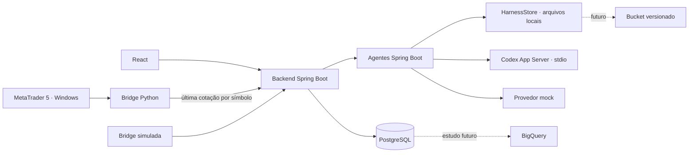

# Sisacao

Estrutura inicial para acompanhar cotações e avaliar agentes. **Não executa ordens.**
O ambiente padrão usa preços simulados e respostas mock, sem consumir um LLM.

## Módulos

| Diretório | Responsabilidade |
| --- | --- |
| `frontend` | React + TypeScript + Vite: cotações, execução manual dos agentes e histórico |
| `backend` | Java 21, Spring Boot 3.5 e Maven: API, validação e persistência |
| `agents` | Java 21, Spring Boot e Maven: catálogo de agentes, harness e cliente Codex App Server |
| `contracts` | DTOs Java compartilhados pelo backend e pelos agentes |
| `bridge` | Python no Windows junto ao MT5; simulador portátil para desenvolvimento |
| `harnesses` | Prompts imutáveis por agente/versão, com SHA-256 em cada resultado |
| `docs` | Arquitetura, integrações e matriz de homologação |



## Rodar localmente

Pré-requisitos: Docker Engine e Docker Compose v2 ou superior.

```bash
cp .env.example .env
docker compose -p sisacao-local up --build -d
```

Abra **http://localhost:3000**. A bridge começa a enviar cotações e os dois agentes
ficam disponíveis. O painel atualiza a cada 5 segundos; uma análise exige ticks
com menos de 60 segundos. A execução mock é identificada no histórico.

Serviços: frontend `3000`, backend `8080`, agentes `8081`, PostgreSQL `5432`.
As portas publicadas ficam em `127.0.0.1`. Altere as variáveis `*_PORT` do `.env`
se necessário. Credenciais do exemplo são exclusivas de desenvolvimento.

```bash
docker compose -p sisacao-local logs -f
docker compose -p sisacao-local down
# Apaga os dados locais quando você não precisar mais deles:
docker compose -p sisacao-local down --volumes --remove-orphans
```

## Desenvolvimento sem empacotar os aplicativos

Requer Java 21, Maven 3.6.3+, Node 22.12+ (ou 20.19+) e Python 3.11+.
Na raiz do repositório, exporte `POSTGRES_PASSWORD` e `BRIDGE_TOKEN` com os mesmos
valores locais do `.env`. Maven/Java/Python não carregam `.env` automaticamente.

```bash
docker compose -p sisacao-local up -d postgres
mvn -B package
java -jar agents/target/agents-0.1.0-SNAPSHOT.jar
# Em outros terminais, sempre na raiz:
java -jar backend/target/backend-0.1.0-SNAPSHOT.jar
python3 bridge/bridge.py
npm ci --include=dev --prefix frontend
npm run dev --prefix frontend
```

O Vite abre em `http://localhost:5173` e encaminha `/api` ao backend.

## Validação

```bash
bash scripts/check.sh
# Com o Compose completo já em execução:
python3 scripts/smoke.py
docker compose -p sisacao-local restart backend
python3 scripts/smoke.py --verify-persistence
cd frontend
npx playwright install chromium
npm run test:e2e
```

`scripts/smoke.py` só aceita origem SIMULATED. Use banco/volume descartável nos
testes: ele injeta uma cotação fictícia de EURUSD (substituída pela bridge em 5s)
e análises fictícias. O teste de navegador também cria análises mock. A [matriz](docs/validation.md)
define caminhos felizes, falhas, integrações, métricas e navegadores.

## Próximas integrações

- [MT5 no Windows e contrato HTTP](docs/integrations.md): adaptador real implementado,
  testado com terminal falso; precisa de homologação em um terminal Windows.
- [Codex App Server](docs/integrations.md#codex-app-server): cliente Java JSONL,
  opt-in via `LLM_PROVIDER=codex`; requer CLI instalada e autenticação própria.
- [Harness, buckets e evolução](docs/architecture.md): porta de armazenamento pronta;
  por enquanto os prompts ficam no Git e são lidos localmente. Nenhum bucket criado.
- BigQuery fica para estudo posterior, sem dependência, dataset ou exportação nesta versão.

Não há ambiente produtivo, domínio ou deploy configurado. A CI valida PRs e `main`,
incluindo builds das imagens e testes integrados. Antes de expor a aplicação fora
do desenvolvimento, adicionar autenticação de usuários/serviços e HTTPS. O escopo
futuro de operações exige contrato de execução, gestão de risco e homologação próprios.
